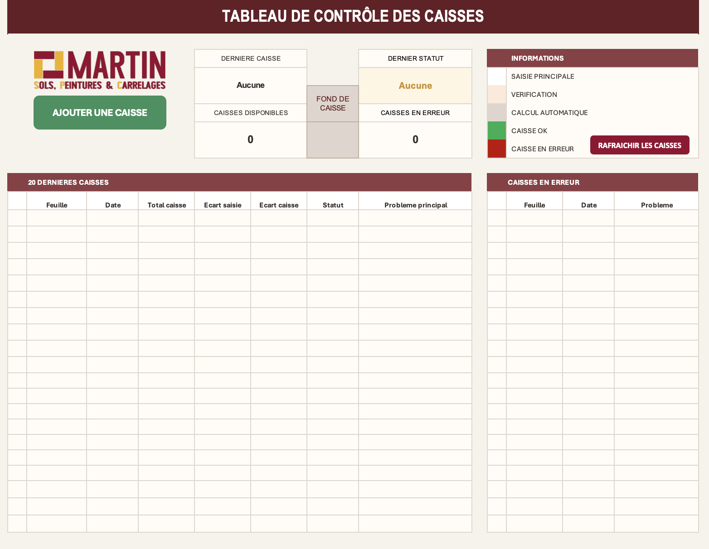
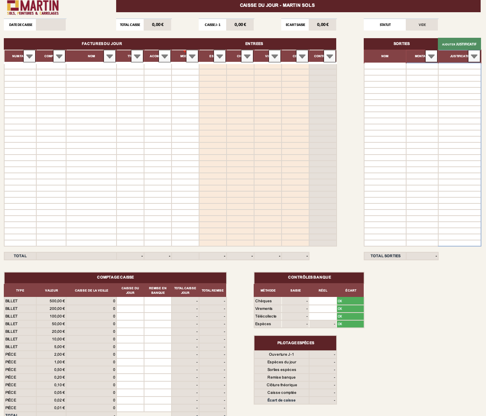

# Controle Caisse

Classeur Excel/VBA de suivi quotidien de caisse pour une activite de type MSP ou point d'accueil, avec controle journalier, creation des jours de caisse, signalement visuel des anomalies et gestion des justificatifs de sortie.

## Objectif

Ce projet sert a :

- creer automatiquement une nouvelle feuille de caisse a partir d'un modele
- reporter la caisse de la veille vers la caisse du jour
- controler les ecarts de saisie et de caisse
- colorer les onglets selon l'etat reel de la feuille
- associer des justificatifs fichiers aux sorties

## Apercu

### Tableau de bord

### Caisse journaliere

## Contenu du depot

- [caisse_ms.xlsm](caisse_ms.xlsm) : classeur principal Excel avec macros
- [vba_fixes/ModuleNouveauJourCaisse.bas](vba_fixes/ModuleNouveauJourCaisse.bas) : creation d'un nouveau jour de caisse, synchronisation des reports et recalcul
- [vba_fixes/ModuleCouleurOngletP3.bas](vba_fixes/ModuleCouleurOngletP3.bas) : logique de statut et coloration automatique des onglets
- [vba_fixes/UploadJustificatifsSortie.bas](vba_fixes/UploadJustificatifsSortie.bas) : ajout d'un justificatif fichier sur une ligne de sortie
- [vba_fixes/ThisWorkbook.cls](vba_fixes/ThisWorkbook.cls) : evenements du classeur
- [vba_fixes/FeuilleVide.cls](vba_fixes/FeuilleVide.cls) : module de feuille vide / support

## Fonctionnement principal

### 1. Nouveau jour de caisse

Le module `ModuleNouveauJourCaisse` :

- detecte la derniere feuille datee au format `jjmmaaaa`
- propose ou calcule la date suivante
- duplique la feuille `MODELE_JOUR`
- met a jour les cellules de report entre les jours
- recalcule les feuilles et relance les controles visuels

Les reports de `caisse de la veille` sont synchronises a partir de la feuille precedente pour eviter les ecarts apres correction d'une caisse plus ancienne.

### 2. Controle visuel par onglet

Le module `ModuleCouleurOngletP3` attribue une couleur d'onglet selon l'etat reel de la feuille :

- vert : caisse OK
- rouge : anomalie ou ecart detecte
- neutre : a verifier / feuille sans statut exploitable

Le controle ne repose pas uniquement sur `P3`. Il tient aussi compte notamment :

- des ecarts de saisie
- des ecarts de caisse
- des erreurs sur les lignes facture
- des controles banque

### 3. Justificatifs de sortie

Le module `UploadJustificatifsSortie` permet :

- de choisir un fichier justificatif (`pdf`, `jpg`, `jpeg`, `png`, `webp`)
- de le copier dans un dossier dedie par jour de caisse
- de creer un lien hypertexte sur la ligne de sortie concernee

Le module verifie que :

- la feuille active est bien une feuille de caisse datee
- le classeur est deja enregistre
- la ligne selectionnee correspond bien a une sortie

## Convention des feuilles

- `ACCUEIL` : synthese / navigation
- `CONFIG` : parametres
- `MODELE_JOUR` : modele servant a creer une nouvelle caisse
- `jjmmaaaa` : feuilles de caisse quotidiennes

## Utilisation

1. Ouvrir le classeur `caisse_ms.xlsm` dans Excel avec les macros actives.
2. Utiliser la macro de creation pour generer la nouvelle caisse du jour.
3. Saisir les encaissements, sorties et controles sur la feuille du jour.
4. Verifier la couleur de l'onglet pour identifier rapidement les anomalies.
5. Ajouter les justificatifs de sortie depuis la ligne concernee si necessaire.

## Development VBA

Les fichiers du dossier `vba_fixes` servent de source lisible/exportee pour les modules VBA. Ils sont utiles pour :

- versionner le code VBA dans GitHub
- relire les modifications hors d'Excel
- reinjecter proprement les modules dans le classeur si besoin

## Recommandations Git

Pour un depot plus propre, il est recommande d'ajouter a terme un `.gitignore` pour exclure :

- `.DS_Store`
- `~$*.xlsm`
- autres fichiers temporaires Excel

## Statut

Projet en cours de structuration GitHub avec un classeur Excel macro-enabled et ses modules VBA exportes.
